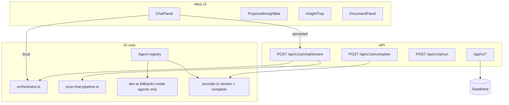

# Cerulean Handoff

**Last updated:** 2026-07-05 (post agent-loom sync @ `96f9e73`)  
**Branch:** `main` — synced with `origin/main` @ `ecf83f2`  
**Read first:** `AGENTS.md` → this file → `docs/agent-shared-context.md`

---

## Start next session here

**Status:** Thinking Loop v2 is **shipped and committed** (`32a1567`). Agent-loom library sync committed (`0898d72`).

**User should say one of:**
- **"verify"** or **"run QA"** — manual QA checklist below
- **"start Phase 5"** — Railway + Supabase deployment (apply migration `003`)
- **"start Phase 6"** — golden tests + doc refresh
- **"bootstrap harness"** — optional; run `harness-generation` (no `docs/harness/manifest.json` yet)

### Phase status (master plan)

| Phase | What | Status |
|-------|------|--------|
| **0** | AI spine — web chat through orchestrator | **Done** |
| **1** | Runtime router + Advanced mode | **Done** |
| **2** | Proactive insight capture | **Done** |
| **3** | Template-first docs (`product_spec` default) | **Done** |
| **4** | Unify promote/expand through orchestrator | **Done** |
| **5** | Deploy Railway + Supabase | **Not started** |
| **6** | Golden tests + doc refresh | **Partial** (8 tests pass; no golden evals) |

### This session (2026-07-05)

| Work | Status |
|------|--------|
| Agent-loom sync from `../agent-loom` @ `96f9e73` | Committed (`0898d72`) |
| New skills: `harness-engineering`, `harness-generation`, `harness-evolution` | Added |
| Updated: 11 library skills (project-setup, eval-pipeline, memory-handoff, etc.) | Synced |
| Protected: `cerulean-*` (3) | Unchanged |
| Forked: `knowledge-graph` (`.next` exclusion) | Preserved |
| agent-loom repo | **Untouched** |
| `npm run build` + `npm test` | Pass (8 tests) |

### Adversarial review fixes (committed in `32a1567`)

| Priority | Issue | Status |
|----------|-------|--------|
| P0 | Duplicate persisted chat messages | Fixed — stream route owns message lifecycle |
| P0 | Server-side AI broken for agents | Fixed — `server-call-ai.ts` + `/api/v1/ai/complete` |
| P1 | Fake streaming | Fixed — `streamProvider()` in `provider.ts` |
| P1 | Two chat brains | Fixed — stream route uses chat agent only |
| P1 | Post-chat blocks stream | Fixed — `done` before `postChat` event |
| P2 | Contradictions hardcoded `[]` | Fixed — `contradictionStore` + post-chat detection |
| P2 | No proposal dedupe | Fixed — dedupe vs existing insights |
| P2 | Tests reimplement logic | Partial — real `heading-match.ts` tests; placement still heuristic in `.mjs` |
| P2 | Zustand in post-chat pipeline | Fixed — client applies results in `workspace-client` |
| P2 | Weak heading match in placement | Fixed — shared `heading-match.ts` with Levenshtein |
| P3 | Public `dev-ai` exports | Fixed — `index.ts` exports orchestrator only |
| P3 | Legacy `/api/ai/chat` | Deprecated — returns 410, use `/api/v1/ai/complete` |

**Locked PM decisions (do not re-litigate):**
- Default document type: **`product_spec`**
- Template change: **ship in v1** (confirm modal)
- Insight proposal latency: **1–3s OK**; never auto-save insights
- Advanced mode: Graph + Exemplar + Import hidden until toggled

---

## Committed history

| Commit | What |
|--------|------|
| `32a1567` | Thinking Loop v2 Phases 0–4 + adversarial P0–P3 fixes (65 files) |
| `0898d72` | Agent-loom sync @ `96f9e73` — harness skills + handoff refresh (34 files) |
| `66d4dfc` | Docs: changelog + handoff updated for `32a1567` |

**Before deploy:** apply migration `003` on Postgres (`supabase/migrations/003_document_templates.sql`).

---

## Manual QA checklist

Run with Supabase env configured (`isPersistenceEnabled()` true):

1. **Persisted chat** — send message → exactly 1 user + 1 assistant row (no duplicates)
2. **Streaming** — assistant text streams; "Thinking..." clears on `done` before proposals appear
3. **Proposals** — 0–3 chips in `ProposedInsightBar` after reply; save/dismiss works
4. **Template** — new workspace seeds `product_spec` sections; template change modal works
5. **Promote** — highlight chat text → patch with section label (e.g. "Open Questions")
6. **Contradictions** — 2+ conflicting insights → tray flags after next chat turn
7. **Advanced mode** — Graph/Exemplar/Import hidden until Settings toggle

Run without Supabase (in-memory): same flows via `streamChatLocal` + orchestrator.

Optional demo: `NEXT_PUBLIC_CERULEAN_DEMO_MODE=true` for seeded workspace.

---

## What Cerulean Is

A thinking workspace with three panels:

| Panel | Module | Stage |
|-------|--------|-------|
| Left | Chat | Exploration |
| Right | Document | Structured composition |
| Bottom | Insight Tray | Insight capture |

Users explore in chat, review proposed insights, and promote into structured document blocks.

---

## Architecture (current)



**Rule enforced:** No `dev-ai` imports in `src/modules/**`. Agents may fall back to `dev-ai` internally.

### Chat stream event sequence (persisted)

1. Server creates user + assistant messages in DB
2. `init` — client adds both to chat store with server IDs
3. `chunk` — streaming tokens; client updates assistant content locally
4. `done` — stream complete; `isStreaming` clears
5. `postChat` — proposals, suggestions, contradictions, ranking scores

### Dual-mode gate

`isPersistenceEnabled()` in `src/lib/config.ts` — requires `NEXT_PUBLIC_SUPABASE_URL` + `NEXT_PUBLIC_SUPABASE_ANON_KEY`.

---

## Agent skills (`.agents/skills/`)

- **112 skills** — 109 library + 3 Cerulean domain (`cerulean-project`, `cerulean-deployment`, `cerulean-mcp`)
- **Last sync:** upstream `96f9e73` (committed `0898d72`)
- **New this sync:** harness suite (`harness-engineering`, `harness-generation`, `harness-evolution`)
- **Fork preserved:** `knowledge-graph` (Cerulean `.next` exclusion in `build_graph.py`)
- **Index:** `docs/SKILL-INDEX.md` | **Routing:** `.agents/ROUTING.md`
- **No harness manifest yet** — `docs/harness/manifest.json` does not exist; optional future work via `harness-generation`

---

## Key files

```
Cerulean/
├── docs/
│   ├── HANDOFF.md                          ← you are here
│   ├── specs/implementation-master-plan.md
│   ├── specs/thinking-loop-v2.md
│   ├── DEPLOYMENT.md                       ← includes migration 003
│   ├── agent-shared-context.md
│   └── agent-change-log.md
├── .agents/
│   ├── agent-loom-sync.json                ← sync config @ 96f9e73
│   └── skills/                             ← 112 skills
├── supabase/migrations/
│   ├── 001_initial_schema.sql
│   ├── 002_username_and_fks.sql
│   └── 003_document_templates.sql          ← required for templates
├── src/
│   ├── app/api/v1/ai/chat/stream/route.ts  ← persisted chat SSE
│   ├── app/api/v1/ai/complete/route.ts     ← agent completions
│   ├── lib/ai/
│   │   ├── orchestrator.ts
│   │   ├── post-chat-pipeline.ts
│   │   ├── server-call-ai.ts
│   │   ├── provider.ts                     ← streamProvider + callProvider
│   │   └── agents/
│   ├── lib/api/workspace-client.ts         ← streamChat, applyPostChatResults
│   ├── lib/document/heading-match.ts
│   └── store/contradictionStore.ts
└── tests/
    ├── heading-match.test.mts
    └── thinking-loop-v2.test.mjs
```

---

## Commands

```bash
npm install
npm run dev          # http://localhost:3000
npm run build        # must pass
npm test             # 8 tests (strip-types + .mjs)
```

With Supabase: copy `.env.example` → `.env.local`, apply migrations 001–003, sign up at `/login`.

---

## What is NOT done

| Item | Notes |
|------|-------|
| **Manual QA** | Checklist below not run in this session |
| **Railway deployment** | Phase 5 — `docs/DEPLOYMENT.md` |
| **Golden / eval tests** | Phase 6 — only smoke + heading-match today |
| **Agent harness bootstrap** | No `docs/harness/` — optional via `harness-generation` |
| **LLM orchestrator routing** | Still `dev-router.ts` (deferred) |
| **Memory management UI** | Tables exist; UI deferred |
| **Memories API** | No `/api/v1/memories` routes |
| **Gemini streaming** | Falls back to buffered completion |
| **User API keys on server stream** | Server uses env keys; client keys via `/api/v1/ai/complete` only |

---

## For the next agent

1. Read `AGENTS.md`, this file, `docs/agent-shared-context.md`.
2. **Do not commit** unless user asks.
3. **Do not modify** `../agent-loom` — sync is one-way into Cerulean.
4. **Do not refactor** module structure unless asked.
5. If user says **"verify"** — run QA checklist and report findings.
5. If user says **"commit"** — working tree is clean @ `0898d72`; only commit if new changes exist.
7. After substantial work: update `agent-change-log.md` and `agent-shared-context.md`.

---

## Doc index

| Doc | Purpose |
|-----|---------|
| `docs/HANDOFF.md` | Session handoff (this file) |
| `docs/specs/implementation-master-plan.md` | Phase plan + gap register |
| `docs/specs/thinking-loop-v2.md` | Product spec |
| `docs/agent-shared-context.md` | Living decisions + code reality |
| `docs/agent-change-log.md` | Change history |
| `docs/DEPLOYMENT.md` | Railway + Supabase + MCP |
| `docs/SKILL-INDEX.md` | Agent skill catalog |
