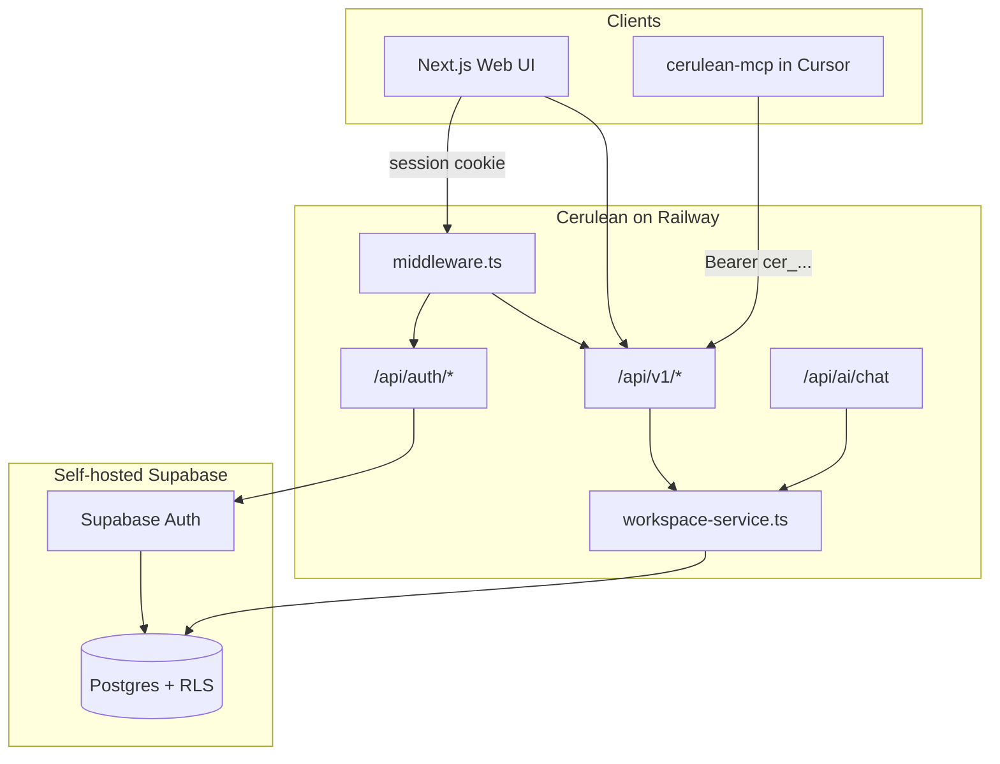

# Cerulean Handoff

**Last updated:** 2026-07-04  
**Branch:** `main` (3 commits ahead of `origin/main`, not pushed)  
**Read first:** `AGENTS.md` → this file → `docs/agent-shared-context.md`

---

## What Cerulean Is

A thinking workspace with three panels:

| Panel | Module | Stage |
|-------|--------|-------|
| Left | Chat | Exploration |
| Right | Document | Structured composition |
| Bottom | Insight Tray | Insight capture |

Users explore ideas in chat, capture insights, and promote them into a structured document (blocks, not a single text blob). An optional knowledge graph links insights and document content.

**Product owner:** PM with minimal coding experience. Explain tradeoffs plainly; own technical decisions unless they affect product direction.

---

## Latest State (July 2026)

### Commits (local only — push when ready)

| Hash | Summary |
|------|---------|
| `0547638` | Supabase persistence, username auth, REST API v1, MCP server |
| `a6313e7` | Remove accidentally committed MCP `node_modules` / `dist` |
| `15c06c7` | Fix changelog commit hashes |

### What works

- Full three-panel UI with panel resize, expand, settings, exemplar upload
- **Dual mode:** with Supabase env → login + Postgres persistence; without → in-memory Zustand (no login)
- **Auth:** username + password sign-in; signup needs username + email + password
- **REST API** at `/api/v1/*` — full workspace CRUD, patches, graph, export, AI actions
- **MCP server** at `packages/cerulean-mcp` — 35+ tools, UI parity
- Multi-agent AI architecture (dev mode + optional Gemini/OpenAI/Anthropic for web chat)
- Graph, settings toggles, exemplar delete persist when Supabase enabled
- `npm run build` and `npm test` pass

### What does NOT work / not done

| Item | Notes |
|------|-------|
| Railway deployment | Documented in `DEPLOYMENT.md`, not automated |
| Self-hosted Supabase on Railway | User must apply migrations manually |
| LLM orchestrator routing | Still rule-based `dev-router.ts`, not LLM routing |
| Memory management UI | Tables exist; UI deferred |
| Auto insight extraction on chat | IDE/MCP must call tools explicitly |
| Main chat → orchestrator | Chat streams direct to provider (intentional for IDE-first) |
| Test coverage | Only smoke tests (`tests/smoke.test.mjs`) |
| Memories API | DB tables exist; no `/api/v1/memories` routes yet |

---

## Architecture



### Dual-mode gate

`isPersistenceEnabled()` in `src/lib/config.ts` checks for `NEXT_PUBLIC_SUPABASE_URL` + `NEXT_PUBLIC_SUPABASE_ANON_KEY`.

- **Off:** Zustand stores only; no middleware redirect; MCP won't work (needs deployed API)
- **On:** Login required; `useWorkspaceSync` hydrates stores from API; all writes go through `workspaceApi`

### Auth model

| Surface | Method | Where validated |
|---------|--------|-----------------|
| Web UI | Supabase session (cookie) | `middleware.ts` + `authenticateRequest` |
| MCP / CLI | API key `cer_...` | `src/lib/auth/api-keys.ts` → `authenticateRequest` |

Passwords live in **Supabase Auth only**. `profiles` table stores `username` (unique, case-insensitive) and `email`.

### Data flow (persisted mode)

1. UI action → `workspaceApi.*` → `/api/v1/*` route
2. Route → `requireAuthWithRateLimit` / `withAuth` → `WorkspaceService(userId)`
3. Service uses **service-role** Supabase client, always filtered by `userId`
4. Response → Zustand store update

Server-side AI (`/api/v1/ai/run`) loads context via `buildAgentContextFromDb(userId)` — not from Zustand.

---

## Key Files

```
Cerulean/
├── docs/
│   ├── HANDOFF.md              ← you are here
│   ├── DEPLOYMENT.md           ← Railway + Supabase setup
│   ├── WHAT-IS-MCP.md          ← plain-language MCP explainer
│   ├── MCP-AGENT-GUIDE.md      ← tool usage for agents
│   ├── PRD.md                  ← product vision (may lag code)
│   └── agent-shared-context.md ← living repo state
├── supabase/migrations/
│   ├── 001_initial_schema.sql
│   └── 002_username_and_fks.sql
├── packages/cerulean-mcp/      ← MCP server (npm install + build after clone)
├── src/
│   ├── app/api/auth/           ← signup, login, logout
│   ├── app/api/v1/             ← REST API
│   ├── app/api/ai/chat/        ← streaming chat (auth required)
│   ├── app/login/              ← login/signup UI
│   ├── middleware.ts           ← session redirect when Supabase configured
│   ├── hooks/useWorkspaceSync.ts
│   ├── lib/
│   │   ├── api/workspace-client.ts  ← UI ↔ API bridge
│   │   ├── auth/                    ← api-keys, rate-limit, request-auth
│   │   ├── db/workspace-service.ts  ← all DB operations
│   │   ├── ai/                      ← orchestrator, agents, context-from-db
│   │   └── supabase/                ← client, server, admin
│   ├── modules/chat|insights|document|graph|settings/
│   └── store/                  ← Zustand (source of truth in local mode)
└── tests/smoke.test.mjs
```

---

## Commands

### Web app (local, no database)

```bash
npm install
npm run dev          # http://localhost:3000 — in-memory mode
npm run build
npm test
```

### Web app (with Supabase)

Copy `.env.example` → `.env.local`, fill Supabase vars, then `npm run dev`. Sign up at `/login`.

### MCP server

```bash
cd packages/cerulean-mcp
npm install
npm run build
# Configure ~/.cursor/mcp.json — see DEPLOYMENT.md
```

---

## Deploy Checklist (Railway)

User has **not** deployed yet. When ready:

1. [ ] Deploy self-hosted Supabase on Railway ([official Docker guide](https://supabase.com/docs/guides/self-hosting/docker))
2. [ ] Run migration `001_initial_schema.sql` then `002_username_and_fks.sql` on Postgres
3. [ ] Deploy Cerulean app; set env vars from `.env.example`
4. [ ] `git push` the 3 local commits
5. [ ] Sign up at `/login` (username + email + password)
6. [ ] Settings → Generate API key → configure MCP
7. [ ] Test: `cerulean_verify_connection` in Cursor

---

## API Quick Reference

All `/api/v1/*` routes require auth (session or `Authorization: Bearer cer_...`). Rate limit: 120 req/min per user+IP.

| Area | Routes |
|------|--------|
| Workspace | `GET /api/v1/workspace` |
| Messages | `GET/POST /api/v1/messages`, `PATCH /api/v1/messages/[id]` |
| Insights | `GET/POST /api/v1/insights`, promote/extract/to-prompt |
| Document | `GET/PATCH /api/v1/document`, blocks CRUD |
| Patches | `GET /api/v1/patches`, accept/reject |
| Graph | `GET /api/v1/graph`, `POST /api/v1/graph/sync` |
| Export | `GET /api/v1/export?format=markdown\|text\|prd` |
| Settings | `GET/PATCH /api/v1/settings` |
| API keys | `GET/POST/DELETE /api/v1/api-keys` (session only for create/delete) |
| AI | `POST /api/v1/ai/run` |

Auth routes (public): `POST /api/auth/signup`, `login`, `logout`

---

## Known Quirks

1. **Middleware** allows all `/api/*` without redirect — each route enforces auth itself.
2. **ChatPanel** saves messages once after streaming ends (not per token) when persistence is on.
3. **MCP `dist/`** is gitignored — must `npm run build` in `packages/cerulean-mcp` after clone.
4. **PRD / master-prompt** mention TipTap and dnd-kit — not installed; custom block editor instead.
5. **Orchestrator** is documented as LLM-routed but code uses `dev-router.ts` (rule-based).
6. **Graph** syncs on workspace load, patch accept, and debounced edits in `GraphView`.

---

## Suggested Next Work (not approved — ask user first)

Priority order if continuing development:

1. **Push commits** and deploy to Railway + Supabase
2. **Memory API** — wire `memories` table to routes + optional UI
3. **LLM orchestrator routing** — replace `dev-router.ts` with LLM call
4. **Integration tests** — auth flow, API key hashing, workspace CRUD
5. **Error monitoring** — before production traffic (Sentry or similar)
6. **Mobile layout** — ask user if phones matter

---

## Doc Index

| Doc | Purpose |
|-----|---------|
| `AGENTS.md` | Rules for AI agents working in this repo |
| `.agents/ROUTING.md` | Skill priority and conflict resolution |
| `docs/SKILL-INDEX.md` | Full skill catalog (105 skills) |
| `docs/HANDOFF.md` | This file — session handoff |
| `docs/agent-shared-context.md` | Living state + decisions |
| `docs/agent-change-log.md` | Change history with commit hashes |
| `docs/DEPLOYMENT.md` | Railway + Supabase + MCP setup |
| `docs/WHAT-IS-MCP.md` | MCP explained for non-engineers |
| `docs/MCP-AGENT-GUIDE.md` | How IDE agents should use Cerulean tools |
| `docs/PRD.md` | Product requirements |
| `docs/master-prompt.md` | System architecture (may lag code) |
| `packages/cerulean-mcp/README.md` | MCP package quick start |

---

## For the Next Agent

1. Read `AGENTS.md` and this file before coding.
2. Do **not** refactor module structure unless explicitly asked.
3. Do **not** implement from open questions or suggested next work without user approval.
4. After substantial changes: update `agent-change-log.md` and `agent-shared-context.md`.
5. Only commit when the user asks.
