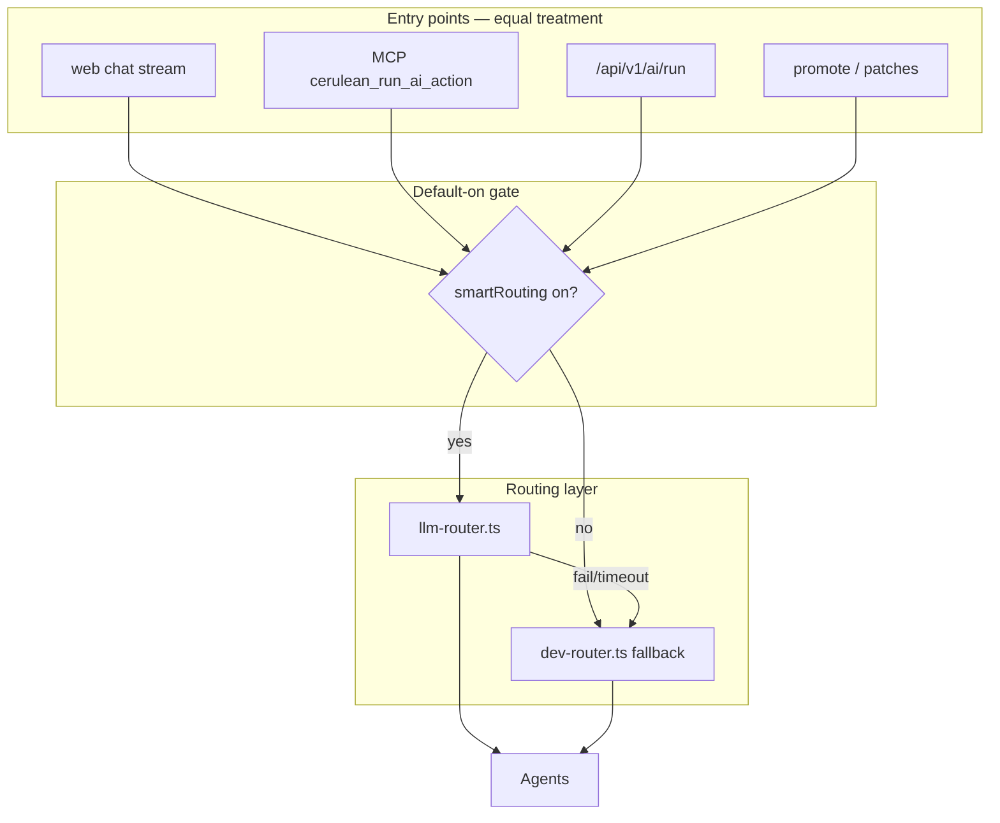

# Implementation Plan: Smart Placement & LLM Orchestrator Routing

## Gate

**Do not start coding until:**

1. Feature spec `status: Approved` ✓ (2026-07-06)
2. `spec-crosscheck` returns PASS (or user explicitly waives) — run before `/implement`

## PM decisions locked (2026-07-06)

| CL | Ruling | Plan impact |
|----|--------|-------------|
| CL-1 | **On by default** (revised) | `smartRouting` + `smartPlacement` default `true`; opt-out toggles in Settings with cost-saving copy |
| CL-2 | **98%** placement accuracy | 50-case golden suite; blocking CI threshold 49/50 |
| CL-3 | Full intelligence for CLI/MCP | No chat exempt; Task 7 = parity tests; stream route uses router when on |

## Context snapshot (code today)

| Area | Today | Target |
|------|-------|--------|
| Placement AI | `document-integration-agent` → `callAIForJSON` → optional `classifyPromotionSection` fallback | Unified `resolvePlacement()` with confidence + low-confidence UI |
| Placement tests | 10 cases @ ≥70% on keyword heuristic | **50 cases @ ≥98%** fallback; LLM eval @ ≥98% when enabled |
| Routing | `dev-router.ts` static `switch(action.type)` | `llm-router.ts` + fallback; **on by default**; opt-out in Settings |
| Chat / MCP | Direct to agents | Smart router **by default** when provider available; rules fallback in dev mode |

## Architecture (target)



**Rules preserved:**

- No `dev-ai` imports in `src/modules/**`
- Dual-mode: `isPersistenceEnabled()` branches unchanged
- Hub-and-spoke: agents still do not call each other

---

## Requirement Traceability

| Requirement | Tasks | Verification |
|-------------|-------|----------------|
| FR-1–FR-6 | T1, T2, T3, T4 | AC-FR-1.1, AC-FR-3.1, golden tests |
| FR-7–FR-11, FR-15–FR-17 | T5, T6, T7 | AC-FR-7.1, AC-FR-15.1, AC-FR-16.1 |
| FR-12–FR-14 | T0.1, T1, T3, T8 | AC-FR-12.1, AC-FR-13.1 |
| NFR-1–NFR-5 | T2, T5, T8 | latency logs, CI job optional |
| CL-3 CLI parity | T7 | MCP + stream route integration tests |

---

## Phase 0 — Prerequisites (0.5 day)

### Task 0.1: Expand golden fixtures to 50 cases

**Description:** Add 40 new labeled placement cases (50 total) across product_spec, strategy_memo, product_analysis; each case tagged with `documentType` and `expectedSection`.

**Traces:** FR-12, CL-2

**Acceptance criteria:**

- [ ] `tests/golden/placement-cases.json` has **50** rows
- [ ] At least 15 cases per structured template type
- [ ] Edge cases: ambiguous text, multi-keyword, short text

**Verification:** JSON lint; count script in test

**Scope:** M (content curation — may need PM review of labels)

---

## Phase 1 — Placement intelligence (1.5–2 days)

### Task 1: Add `resolve-placement` with confidence model

**Description:** Single function returns `{ targetSection, confidence, source: 'llm' | 'heuristic' }` used by document-integration agent and tests.

**Traces:** FR-1, FR-2, FR-4, FR-5, NFR-3, NFR-4

**Acceptance criteria:**

- [ ] Structured LLM schema: `{ target_section, confidence, reasoning? }`
- [ ] Invalid/missing AI → heuristic with capped confidence
- [ ] Text &lt;20 chars → heuristic only, confidence `low`

**Verification:**

- [ ] `npm test` — new `placement-resolve.test.mts` or extend `golden-thinking-loop.test.mjs`
- [ ] Unit tests for all confidence branches

**Files:**

- `src/lib/document/resolve-placement.ts` (new)
- `src/lib/document/classify-section.ts` (extend: return score + confidence)
- `src/lib/ai/agents/document-integration-agent.ts` (delegate to resolve-placement)
- `src/types/index.ts` — `PlacementConfidence` type on `Patch`

**Dependencies:** Task 0.1

**Scope:** M

---

### Task 2: Persist and show placement confidence in UI

**Description:** Patch preview shows low-confidence hint; DB/API store `placement_confidence` when persisted.

**Traces:** FR-3, FR-6, NFR-1

**Acceptance criteria:**

- [ ] `PatchReview` shows hint when `placement_confidence === 'low'`
- [ ] Migration `004_patch_placement_confidence.sql` adds nullable column
- [ ] Promote API returns confidence in patch object

**Verification:**

- [ ] Manual: promote vague text → see warning
- [ ] `npm run build`

**Files:**

- `supabase/migrations/004_patch_placement_confidence.sql`
- `src/modules/document/PatchReview.tsx`
- `src/lib/db/workspace-service.ts`
- `src/app/api/v1/patches/route.ts`

**Dependencies:** Task 1

**Scope:** M

---

### Task 3: Improve classifier to ≥98% golden (49/50)

**Description:** Tune heuristic + LLM prompt jointly until fallback path meets **98%** on 50 cases. Expect keyword rules, tie-breakers, template-specific weights, and disputed cases resolved with PM.

**Traces:** FR-13, CL-2

**Acceptance criteria:**

- [ ] `golden-thinking-loop.test.mjs` asserts **≥98%** (49/50 minimum)
- [ ] Failures print case id + expected vs actual for triage
- [ ] Any single persistent failure → mark case ambiguous and replace (with PM)

**Verification:** `npm test`

**Scope:** L (98% is strict; may need 2 iterations)

---

### Task 4: Wire placement metrics

**Description:** Extend session metrics with `promotion_low_confidence` and `placement_source` counts.

**Traces:** Success metrics table in spec

**Acceptance criteria:**

- [ ] `trackMetric('promotion_low_confidence')` on low-confidence patches
- [ ] `getSessionKpis()` exposes rate

**Files:**

- `src/lib/metrics/session-metrics.ts`
- `src/modules/document/PatchReview.tsx` or patch create path

**Dependencies:** Task 2

**Scope:** XS

---

## Phase 2 — LLM orchestrator routing (1.5–2 days)

### Task 5: Implement `llm-router.ts`

**Description:** LLM routing when `context.settings.smartRouting !== false` (default **true**). JSON schema `{ primary_agent, background_agents[], confidence }`; validate; fallback to `dev-router`.

**Traces:** FR-7, FR-8, FR-9, FR-10, FR-15, NFR-2, NFR-3, NFR-4

**Acceptance criteria:**

- [ ] When `smartRouting` false (user disabled) → **never** calls LLM
- [ ] When `smartRouting` true (default) + no provider → rules fallback, no error
- [ ] Timeout 400ms → fallback
- [ ] Unknown agent id → fallback
- [ ] Disabled background agents filtered out
- [ ] Applies to `chat.respond` when enabled (no exempt list)

**Scope:** L

---

### Task 6: Integrate router + Settings (default on, opt-out)

**Description:** Two toggles in Settings → Advanced: **Smart routing** and **Smart placement** — both default **on**. Copy explains disabling saves LLM calls. Migration sets existing users to `true`.

**Traces:** FR-15, FR-16, FR-7, CL-1

**Acceptance criteria:**

- [ ] DB columns `smart_routing`, `smart_placement` default `true`
- [ ] Migration `005_smart_features.sql` sets existing users to `true`
- [ ] Toggle off shows: “Uses fewer AI calls — placement/routing may be less accurate”
- [ ] `orchestrator.runAiAction` uses llm-router when smart routing on (default)
- [ ] MCP `runAiAction` → same server route → same behavior

**Files:**

- `src/lib/ai/orchestrator.ts`
- `src/lib/ai/runtime-router.ts`
- `src/modules/settings/SettingsPanel.tsx`
- `supabase/migrations/005_smart_features.sql`
- `packages/cerulean-mcp` — verify no local routing bypass

**Scope:** M

---

### Task 7: Web + MCP routing parity

**Description:** Ensure chat stream route and MCP AI tools use orchestrator with same smart-routing gate. Add integration tests proving identical routing decision for same action from web vs API key auth.

**Traces:** FR-11, FR-17, CL-3, AC-FR-16.1

**Acceptance criteria:**

- [ ] `POST /api/v1/ai/chat/stream` respects `smartRouting` (router before chat agent when on)
- [ ] MCP `cerulean_run_ai_action` → `/api/v1/ai/run` → same orchestrator path
- [ ] Test: smart routing off → both use rules; on → both use llm-router (mocked)

**Files:**

- `src/app/api/v1/ai/chat/stream/route.ts`
- `packages/cerulean-mcp/src/client.ts` (audit only; fix if bypass)
- `tests/routing-parity.test.mjs`

**Dependencies:** Task 5, Task 6

**Scope:** M

---

## Phase 3 — Eval pipeline & docs (1 day)

### Task 8: Optional LLM eval job

**Description:** Script or test gate run when `CERULEAN_EVAL_LLM=true` measures end-to-end placement with real provider.

**Traces:** FR-14, NFR-5

**Acceptance criteria:**

- [ ] `npm run test:eval` skips without env
- [ ] With `CERULEAN_EVAL_LLM=true` + smart placement on → **≥98%** accuracy
- [ ] Documents env vars in `docs/DEPLOYMENT.md` and `packages/cerulean-mcp/README.md`

**Files:**

- `tests/eval/placement-llm-eval.mjs`
- `package.json` script
- `docs/DEPLOYMENT.md`

**Dependencies:** Task 1, Task 3

**Scope:** S

---

### Task 9: Docs, handoff, crosscheck

**Description:** Update HANDOFF, agent-shared-context, implementation-master-plan gap register; run spec-crosscheck.

**Traces:** SDD process

**Files:**

- `docs/HANDOFF.md`
- `docs/agent-shared-context.md`
- `docs/specs/implementation-master-plan.md`
- `docs/reviews/2026-07-06-smart-routing-and-placement-spec-crosscheck.md`

**Dependencies:** All tasks

**Scope:** S

---

## Risk Register

| Risk | Impact | Mitigation |
|------|--------|------------|
| 98% bar hard to hit | Schedule slip | 50 curated cases; PM reviews ambiguous labels; LLM+heuristic ensemble |
| Surprise costs for unaware users | Medium | Settings copy explains opt-out; dev mode uses free fallbacks only |
| LLM router adds latency (default on) | Chat feels slower | 400ms timeout; rules fallback; user can disable |
| MCP drift from web | CLI second-class | Task 7 parity tests; single orchestrator entry |
| Router hallucinates wrong agent | Wrong behavior | JSON schema + registry validation + fallback |

## Definition of Done (program)

- [ ] Golden fallback placement **≥98%** (49/50 on 50 cases)
- [ ] Smart routing + smart placement **on by default**; opt-out in Settings
- [ ] Web chat stream + MCP use **same** router when smart routing on
- [ ] Low-confidence promotes show UI warning
- [ ] `npm test` passes; `npm run build` clean
- [ ] Spec crosscheck PASS; HANDOFF updated

## Suggested implementation order

```
0.1 → 1 + 3 (parallel, 3 may take 2 passes) → 2 → 4
0.1 → 5 → 6 → 7
8 → 9
```

**Next SDD step:** Run `/analyze` (`spec-crosscheck`) → `/implement` when PASS.

| ID | Task | Scope |
|----|------|-------|
| T0.1 | 50 golden cases | M |
| T1 | resolve-placement | M |
| T2 | UI + migration confidence | M |
| T3 | **≥98%** classifier | L |
| T4 | Placement metrics | XS |
| T5 | llm-router (default on) | L |
| T6 | Settings default on + opt-out | M |
| T7 | **Web + MCP parity** | M |
| T8 | LLM eval @ 98% | S |
| T9 | Docs + crosscheck | S |
