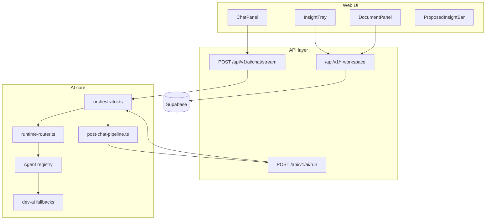

# Cerulean — Master Implementation Plan (Thinking Loop v2 + Gap Closure)

**Status:** Implementation-ready  
**Date:** 2026-07-04  
**Companion spec:** [`thinking-loop-v2.md`](./thinking-loop-v2.md)  
**Audience:** Engineering agents and PM review

---

## Locked product decisions

| Decision | Choice |
|----------|--------|
| Insight proposal latency | **Accept 1–3s** after reply; await before showing chips; do not block chat input |
| Default document type | **`product_spec`** (not PRD, not blank) |
| Template change | **Ship in v1** — user can switch template anytime with explicit confirm |
| Insight auto-save | **Never** — propose only; one-click save |
| Advanced UI | Graph + Exemplar hidden until Advanced mode |
| LLM orchestrator routing | **Defer** — keep rule-based `dev-router` for MVP |
| Memory / exemplar UI | **Defer** Meta runtime to Advanced-only surfaces |

---

## Target architecture (end state)



**Rule:** No `src/modules/**` imports from `dev-ai.ts` directly. Modules call `workspaceApi` or orchestrator endpoints only.

---

## Gap register (complete)

Severity: **B** = blocks demo/investor story · **M** = wrong behavior or dual-path debt · **S** = polish/docs/tests

### BIG — blocks product promise

| ID | Gap | Current state | Fix |
|----|-----|---------------|-----|
| GAP-B01 | Web chat bypasses orchestrator | `ChatPanel` → `streamChatResponse` from `dev-ai` | Route through `chat.respond` + streaming API |
| GAP-B02 | No proactive insight capture | Manual highlight only | `insight.propose` + `ProposedInsightBar` |
| GAP-B03 | Blank document at birth | `Untitled Document`, 0 blocks | Default `product_spec` template + picker |
| GAP-B04 | Promotion ignores structure | `generatePromotionPatch` appends / "Key Ideas" | Section-aware placement + preview |
| GAP-B05 | Not deployed | Local only | Railway + Supabase per `DEPLOYMENT.md` |
| GAP-B06 | Dual AI paths (web vs MCP) | MCP uses orchestrator; web uses dev-ai | Single spine (GAP-B01) |
| GAP-B07 | Background agents never run on web chat | No post-chat hook from ChatPanel | `post-chat-pipeline.ts` after stream |

### MEDIUM — correctness & maintainability

| ID | Gap | Current state | Fix |
|----|-----|---------------|-----|
| GAP-M01 | Promote bypasses Document Integration Agent | `workspace-service.promoteText`, `InsightTray`, `ChatPanel` call `generatePromotionPatch` | `document.promote` via orchestrator/API |
| GAP-M02 | Document expand client-side only in persisted mode | `DocumentBlockView.runAiAction` without `userId` | `workspaceApi.runAiAction` server path |
| GAP-M03 | API routes bypass agents | `/insights/extract`, `/insights/to-prompt` import `dev-ai` | Delegate to `runAiAction` |
| GAP-M04 | ThinkingSuggestions client-side dev-ai | No server context in persisted mode | Feed from post-chat `suggestion.generate` result store |
| GAP-M05 | InsightTray local promote path | `generatePromotionPatch` in component | `workspaceApi.createPatch` / promote API always |
| GAP-M06 | Signup seeds blank document | `handle_new_user` trigger | Default `product_spec` + heading blocks |
| GAP-M07 | No `document_type` in schema | Missing column | Migration `003_document_templates.sql` |
| GAP-M08 | `exportPRD` misaligned with templates | Hardcoded section names | `exportByTemplate(document_type)` |
| GAP-M09 | Advanced features always visible | Graph tab, Exemplar in header | Advanced mode gate |
| GAP-M10 | Chat agent uses client fetch without auth context | `callRealProvider` in browser | Server-side streaming with session |
| GAP-M11 | No template change flow | Spec deferred | v1 change-template modal + merge algorithm |
| GAP-M12 | Runtime consolidation not started | 11 agents, scattered actions | `runtime-router.ts` + 4 groups |

### SMALL — docs, tests, hygiene

| ID | Gap | Fix |
|----|-----|-----|
| GAP-S01 | `HANDOFF.md` stale (unpushed commits, wrong chat note) | Refresh after each phase |
| GAP-S02 | `agent-shared-context.md` stale push state | Update |
| GAP-S03 | Only smoke tests | Hero-loop integration tests |
| GAP-S04 | No migration 003 in DEPLOYMENT.md | Add to deploy checklist |
| GAP-S05 | `hooks/` not wired (Claude-only) | Document in HANDOFF; optional |
| GAP-S06 | Memories API missing | Defer; note in Open Questions |
| GAP-S07 | Demo workspace not seeded | Phase 6 deliverable |
| GAP-S08 | Investor empty-state copy generic | Guided 3-step overlay |
| GAP-S09 | `patches` table lacks `placement_label` | JSONB metadata column or patch fields |
| GAP-S10 | Proposals not in SKILL-OUTPUTS pattern | Log on ship |

---

# Workstream specs

## WS-0 — AI spine (closes GAP-B01, B06, B07, M10)

### 0.1 Streaming chat API (server)

**New:** `POST /api/v1/ai/chat/stream`

```typescript
// Request
{ userMessage: string; conversationId?: string }

// Response: text/event-stream or chunked JSON lines
{ type: "chunk", text: string }
{ type: "done", messageId: string, assistantMessageId: string }
{ type: "background", jobId: string }  // optional
```

**Implementation:**
- Auth via `authenticateRequest` (same as `/api/ai/chat`)
- `buildAgentContextFromDb(userId)`
- `runAiAction({ type: "chat.respond", input: { userMessage } }, { userId, onChunk })`
- Persist user + assistant messages via `WorkspaceService` inside route (move logic out of ChatPanel for persisted mode)

**Files:**
- `src/app/api/v1/ai/chat/stream/route.ts` (new)
- `src/lib/ai/orchestrator.ts` — ensure `onChunk` propagates
- `src/lib/api/workspace-client.ts` — `streamChat(userMessage, onChunk)`

### 0.2 ChatPanel rewrite

- Remove `import { streamChatResponse, generatePromotionPatch } from "@/lib/ai"`
- `handleSend` → `workspaceApi.streamChat` (persisted) OR `runAiAction` with local context builder (in-memory)
- On `done` → call `runPostChatPipeline(assistantMessageId)`

**Files:** `src/modules/chat/ChatPanel.tsx`

### 0.3 Post-chat pipeline

**New:** `src/lib/ai/post-chat-pipeline.ts`

```typescript
export async function runPostChatPipeline(opts: {
  userId?: string;
  context: AgentContext;
  assistantMessageId: string;
  userMessage: string;
  assistantMessage: string;
  settings: AiSettingsSnapshot & { suggestInsights: boolean };
  onProposals?: (p: ProposedInsight[]) => void;
  onSuggestions?: (s: ThinkingSuggestion[]) => void;
}): Promise<void>
```

Parallel `Promise.allSettled` for propose + suggestion + ranking + graph.

Invoke from orchestrator tail **or** chat stream route after message saved.

### 0.4 In-memory mode parity

**New:** `src/lib/ai/context-from-stores.ts` — build `AgentContext` from Zustand (client-only path).

Client calls `runAiAction` only when `!isPersistenceEnabled()`; otherwise always API.

**Acceptance:**
- [ ] GAP-B01 closed: no direct dev-ai in ChatPanel
- [ ] With `OPENAI_API_KEY` set, chat returns real model output on web
- [ ] Without keys, dev fallback still streams
- [ ] Post-chat pipeline fires in both modes

---

## WS-1 — Runtime router + Advanced mode (closes GAP-M09, M12)

### 1.1 Runtime router

**New:** `src/lib/ai/runtime-router.ts`

Maps:
- `conversation.respond` → `chat`
- `conversation.propose_insights` → `insight_extraction` (propose mode)
- `document.integrate` → `document_integration` (+ optional `tonal_adjustment`)
- `document.expand` → `document_expansion`
- `graph.refresh` → `knowledge_graph` + `ranking`

`orchestrator.ts` accepts legacy `AiAction` + dispatches through router internally.

### 1.2 Advanced mode

**Settings JSON** (`user_settings`):

```typescript
interface WorkspaceUiSettings {
  advancedMode: boolean;
  suggestInsights: boolean;
  backgroundAgents: { ... };
}
```

**UI:**
- `Workspace.tsx` — hide Graph tab + Exemplar button when `!advancedMode`
- `SettingsPanel.tsx` — simplified default panel; Advanced expands full matrix

**Files:** `src/modules/settings/SettingsPanel.tsx`, `src/store/aiSettingsStore.ts`, settings API

**Acceptance:**
- [ ] Fresh user sees Chat | Document only (+ Insights tray)
- [ ] Advanced toggle persists (Supabase + localStorage fallback)

---

## WS-2 — Proactive insight capture (closes GAP-B02)

### 2.1 Action + agent

**Add to `actions.ts`:**

```typescript
export interface InsightProposeAction {
  type: "insight.propose";
  input: {
    userMessage: string;
    assistantMessage: string;
    assistantMessageId: string;
  };
}
```

**Extend** `insight-extraction-agent.ts`:
- `mode: "import" | "propose"` via input discriminator
- Propose prompt: return JSON `{ proposals: [...] }` max 3
- Dev fallback: heuristic extractor (max 2)

### 2.2 Client store + UI

**New:**
- `src/store/proposedInsightStore.ts`
- `src/modules/chat/ProposedInsightBar.tsx`

**Wire:** ChatPanel renders bar after pipeline returns; Save → `addInsight` / `workspaceApi.addInsight`

**Dismiss:** `sessionStorage` key `cerulean_dismissed_proposals`

### 2.3 Settings

- `suggestInsights: boolean` default `true` in settings (not Advanced-only)

**Acceptance:** All Initiative A criteria in `thinking-loop-v2.md`

---

## WS-3 — Template-first documents + template change (closes GAP-B03, B04, M06–M08, M11)

### 3.1 Document types

| Type ID | UI label | Default title |
|---------|----------|---------------|
| `product_spec` | **Product Spec** | Product Spec |
| `strategy_memo` | Strategy Memo | Strategy Memo |
| `product_analysis` | Product Analysis | Product Analysis |
| `blank` | Blank | Untitled Document |

**Default for all new workspaces:** `product_spec`

### 3.2 Product Spec sections (heading-only seeds)

| Order | Heading |
|-------|---------|
| 1 | Overview |
| 2 | Problem |
| 3 | Users |
| 4 | Requirements |
| 5 | Solution |
| 6 | Success Metrics |
| 7 | Non-Goals |
| 8 | Open Questions |

Placement fallback for low confidence: **Open Questions**.

### 3.3 Schema migration `003_document_templates.sql`

```sql
ALTER TABLE public.documents
  ADD COLUMN IF NOT EXISTS document_type TEXT NOT NULL DEFAULT 'product_spec'
    CHECK (document_type IN ('blank', 'product_spec', 'strategy_memo', 'product_analysis'));

ALTER TABLE public.documents
  ADD COLUMN IF NOT EXISTS template_version SMALLINT NOT NULL DEFAULT 1;

ALTER TABLE public.patches
  ADD COLUMN IF NOT EXISTS placement_label TEXT,
  ADD COLUMN IF NOT EXISTS placement_block_id UUID;
```

Update `handle_new_user()`:
- Insert document with `document_type = 'product_spec'`, title `Product Spec`
- Call `seed_template_blocks(new_document_id, 'product_spec')` via SQL function or app-layer on first login

**App-layer approach (simpler):** after signup/login first load, if `blocks.length === 0` && `document_type === 'product_spec'`, seed headings.

### 3.4 Template registry

**New:** `src/lib/document-templates/`
- `index.ts` — `getTemplate`, `getSectionHeadings`, `seedBlocks`
- `product-spec.ts`, `strategy-memo.ts`, `product-analysis.ts`

### 3.5 First-run picker

**New:** `src/components/DocumentTypePicker.tsx`

- Shown when: local init OR first workspace load with 0 blocks and never picked (`settings.hasChosenTemplate`)
- **Pre-select: Product Spec**
- Options: Product Spec | Strategy Memo | Product Analysis | Blank

### 3.6 Template change (v1 — required)

**Entry points:**
- Document panel `⋯` menu → **Change template…**
- Settings → Document → **Template type**

**Flow:**

```
1. User selects new type
2. If document has zero content blocks → apply immediately (re-seed headings)
3. If document has content → confirmation modal:

   ┌─────────────────────────────────────────────┐
   │ Change to Strategy Memo?                  │
   │                                             │
   │ • Keep all your written content             │
   │ • Add 6 new section headings where missing  │
   │ • Content in sections that don't exist in   │
   │   the new template moves to "Carryover"     │
   │                                             │
   │        [Cancel]  [Change template]          │
   └─────────────────────────────────────────────┘
```

**Merge algorithm** (`src/lib/document-templates/change-template.ts`):

1. Load current blocks sorted by position.
2. Load target template heading list.
3. For each existing **heading** block: if title matches a target section (fuzzy match), keep as-is.
4. For each existing **content** block: attach to nearest preceding heading; map heading to target section or **Carryover**.
5. Insert missing target headings (empty) in template order.
6. If **Carryover** needed: insert heading `Carryover` at end; append orphan paragraphs there.
7. Recompute `position` values (0, 1, 2, …).
8. Update `documents.document_type`, `template_version`, optionally `title`.
9. Persist via `WorkspaceService.replaceBlocks()` (new bulk method) or delete+insert in transaction.

**API:**

```
PATCH /api/v1/document
{ documentType: "strategy_memo" }  // triggers server-side merge

POST /api/v1/document/preview-template-change
{ documentType: "strategy_memo" }
→ { summary: string, carryoverCount: number, newHeadings: string[] }
```

### 3.7 Section-aware promotion

**New:** `src/lib/document/placement.ts`

```typescript
export function buildPromotionPatch(opts: {
  text: string;
  blocks: DocumentBlock[];
  documentType: DocumentType;
  insightId?: string | null;
  sourceMessageIds: string[];
  targetSection?: string;  // from agent
}): { operations: PatchOperation[]; placement_label: string; placement_block_id: string }
```

**Document Integration Agent** returns `{ target_section, adapted_text }` via `callAIForJSON`.

**Wire promote paths:**
- `ChatPanel.handlePromoteToDocument` → `workspaceApi.promoteText` (always)
- `InsightTray` promote → `workspaceApi.promoteInsight` / existing route
- Remove `generatePromotionPatch` from components
- `workspace-service.promoteText` → calls `runAiAction` server-side OR inlines placement after agent call

### 3.8 Patch review UI

`PatchReview.tsx` shows:

```
Adding under: Requirements
```

**Acceptance:**
- [ ] New workspace defaults to Product Spec with 8 headings
- [ ] Template change with content preserves text; preview accurate
- [ ] Promotion places into correct section ≥70% on golden set
- [ ] `exportByTemplate()` replaces `exportPRD`

---

## WS-4 — Promote & expand unified (closes GAP-M01, M02, M05)

| Caller | Target |
|--------|--------|
| `ChatPanel` promote | `POST /api/v1/patches` with `{ text }` only — server runs agent |
| `InsightTray` promote | `POST /api/v1/insights/:id/promote` (exists) — fix server agent path |
| `DocumentBlockView` expand | `workspaceApi.runAiAction({ type: "document.expand", ... })` |

**Change `workspace-service.promoteText`:**

```typescript
async promoteText(...) {
  const result = await runAiAction({ type: "document.promote", input: {...} }, { userId: this.userId });
  return this.createPatch({ operations: result.data.operations, placement_label, ... });
}
```

Note: `runAiAction` in server context must not import client stores.

**Acceptance:**
- [ ] No `generatePromotionPatch` imports in `src/modules/**`
- [ ] Expand works with Supabase enabled

---

## WS-5 — API hygiene (closes GAP-M03, M04)

| Route | Change |
|-------|--------|
| `POST /api/v1/insights/extract` | `runAiAction({ type: "insight.extract", ... })` |
| `POST /api/v1/insights/to-prompt` | `runAiAction({ type: "insight.to_prompt", ... })` |
| `POST /api/v1/ai/run` | Accept `RuntimeRequest` + legacy actions |

**ThinkingSuggestions:** read from `suggestionStore` populated by post-chat pipeline instead of calling dev-ai in `useMemo`.

**New:** `src/store/suggestionStore.ts` (last suggestions + timestamp)

---

## WS-6 — Deploy & demo (closes GAP-B05, S07, S08)

### 6.1 Railway deploy

- Connect repo; env vars from `DEPLOYMENT.md`
- Run migrations 001, 002, **003**
- Smoke: signup → login → chat → insight → promote

### 6.2 Demo workspace flag

Env `CERULEAN_DEMO_MODE=true` or seed script:
- Pre-filled Product Spec headings with 1–2 example paragraphs
- 3 insights in tray
- 2 chat messages in conversation

### 6.3 Guided overlay (first visit)

`localStorage.cerulean_onboarding_v1`:
1. Highlight chat input — “Ask about your product problem”
2. Highlight ProposedInsightBar or highlight menu
3. Highlight patch accept

**Files:** `src/components/OnboardingGuide.tsx`

---

## WS-7 — Tests & docs (closes GAP-S01–S04, S03)

### Tests (`tests/`)

| File | Covers |
|------|--------|
| `template-merge.test.mjs` | change-template algorithm |
| `placement.test.mjs` | section mapping golden prompts |
| `insight-propose.test.mjs` | dev heuristic max 2, dedupe |
| `hero-loop.test.mjs` | API integration (optional, needs test Supabase) |

### Docs updates (each phase)

- `docs/HANDOFF.md` — reality table, remove stale commit push note
- `docs/DEPLOYMENT.md` — migration 003
- `docs/agent-shared-context.md`
- `docs/specs/thinking-loop-v2.md` — keep aligned

---

# Implementation schedule

## Phase 0 — Spine (3–4 days) · WS-0

| # | Task | Gaps | Est |
|---|------|------|-----|
| 0.1 | `context-from-stores.ts` | B01 | 4h |
| 0.2 | `/api/v1/ai/chat/stream` | B01, M10 | 8h |
| 0.3 | `workspaceApi.streamChat` | B01 | 4h |
| 0.4 | Refactor `ChatPanel` | B01 | 4h |
| 0.5 | `post-chat-pipeline.ts` stub | B07 | 4h |
| 0.6 | Smoke: chat persisted + local | S03 | 2h |

**Exit gate:** Real provider works on web; dev fallback works; no ChatPanel → dev-ai.

---

## Phase 1 — Runtime + Advanced (2–3 days) · WS-1

| # | Task | Gaps | Est |
|---|------|------|-----|
| 1.1 | `runtime-router.ts` | M12 | 6h |
| 1.2 | Orchestrator delegates to router | M12 | 4h |
| 1.3 | Advanced mode setting + UI | M09 | 6h |
| 1.4 | Hide Graph/Exemplar | M09 | 2h |

---

## Phase 2 — Proactive capture (3 days) · WS-2

| # | Task | Gaps | Est |
|---|------|------|-----|
| 2.1 | `insight.propose` action + agent | B02 | 6h |
| 2.2 | Pipeline wire propose | B02, B07 | 4h |
| 2.3 | `proposedInsightStore` + bar UI | B02 | 6h |
| 2.4 | Settings toggle | B02 | 2h |
| 2.5 | Dedupe + dismiss | B02 | 4h |

---

## Phase 3 — Templates + change (4–5 days) · WS-3

| # | Task | Gaps | Est |
|---|------|------|-----|
| 3.1 | Migration 003 | M07, S04 | 2h |
| 3.2 | Template registry + product_spec default | B03, M06 | 6h |
| 3.3 | `DocumentTypePicker` (default Product Spec) | B03 | 4h |
| 3.4 | Signup/first-load seed | M06 | 4h |
| 3.5 | `change-template.ts` + preview API | M11 | 8h |
| 3.6 | Change template modal UI | M11 | 6h |
| 3.7 | `placement.ts` + agent update | B04 | 8h |
| 3.8 | Patch `placement_label` UI | B04, S09 | 4h |
| 3.9 | `exportByTemplate` | M08 | 3h |

---

## Phase 4 — Promote/expand unify (2 days) · WS-4, WS-5

| # | Task | Gaps | Est |
|---|------|------|-----|
| 4.1 | Server `promoteText` via orchestrator | M01, M05 | 6h |
| 4.2 | Remove component-level patch gen | M01, M05 | 4h |
| 4.3 | `DocumentBlockView` → API expand | M02 | 4h |
| 4.4 | API extract/to-prompt → orchestrator | M03 | 3h |
| 4.5 | `suggestionStore` + ThinkingSuggestions | M04 | 4h |

---

## Phase 5 — Deploy + demo (2 days) · WS-6

| # | Task | Gaps | Est |
|---|------|------|-----|
| 5.1 | Railway + Supabase deploy | B05 | 8h |
| 5.2 | Demo seed / onboarding overlay | S07, S08 | 6h |
| 5.3 | Live URL smoke checklist | B05 | 2h |

---

## Phase 6 — Quality (2 days) · WS-7

| # | Task | Gaps | Est |
|---|------|------|-----|
| 6.1 | Golden tests (placement, propose, merge) | S03 | 8h |
| 6.2 | HANDOFF + shared context refresh | S01, S02 | 2h |
| 6.3 | Investor script in empty states | S08 | 2h |

---

**Total estimate:** ~22–26 engineering days (single agent sequential); ~12–15 calendar days with parallel UI/API tracks.

---

# Dependency graph

```
Phase 0 (Spine) ──┬──► Phase 2 (Capture)
                  ├──► Phase 4 (Promote unify)
                  └──► Phase 1 (Runtime) ──► Phase 3 (Templates)
Phase 3 + 2 ────────► Phase 5 (Deploy demo)
Phase 5 ────────────► Phase 6 (Quality)
```

**Critical path:** 0 → 4 → 3 → 5 → 6  
**Parallelizable after Phase 0:** Phase 1 + Phase 2

---

# Definition of done (program)

1. Live URL; signup works with self-hosted Supabase.
2. New workspace → **Product Spec** template (8 sections).
3. User can **change template** anytime with confirm + content preserved.
4. Chat uses real AI when configured; dev fallback otherwise.
5. After each reply, **0–3 insight chips** appear (~1–3s); one-click save.
6. Promote shows **“Adding under: {section}”**; patch lands correctly.
7. Export produces readable Product Spec markdown.
8. Graph/Exemplar hidden until Advanced mode.
9. Zero `dev-ai` imports in `src/modules/**`.
10. Golden tests pass in CI.

---

# Explicitly deferred (post-v2)

| Item | Reason |
|------|--------|
| LLM orchestrator routing | Rule-based sufficient for MVP |
| Memory management UI / API | Meta runtime; tables exist |
| `insight_proposals` DB table | sessionStorage enough for v1 |
| SSE for proposals | Await API acceptable per PM |
| Multi-workspace | Single workspace per user for now |
| TipTap / dnd-kit | Custom blocks work; large refactor |

---

# Open questions (none blocking — defaults chosen)

| Question | Default |
|----------|---------|
| Carryover section name | `Carryover` |
| Fuzzy heading match threshold | Case-insensitive exact, then Levenshtein ≤2 |
| Re-seed on template change to `blank` | Remove template headings only; keep all content blocks |
| product_spec vs feature-spec skill alignment | Cerulean template is product-facing; link in docs only |

---

# File manifest (all new/changed)

### New files
```
src/app/api/v1/ai/chat/stream/route.ts
src/app/api/v1/document/preview-template-change/route.ts
src/lib/ai/post-chat-pipeline.ts
src/lib/ai/runtime-router.ts
src/lib/ai/context-from-stores.ts
src/lib/document/placement.ts
src/lib/document-templates/index.ts
src/lib/document-templates/product-spec.ts
src/lib/document-templates/strategy-memo.ts
src/lib/document-templates/product-analysis.ts
src/lib/document-templates/change-template.ts
src/store/proposedInsightStore.ts
src/store/suggestionStore.ts
src/modules/chat/ProposedInsightBar.tsx
src/components/DocumentTypePicker.tsx
src/components/ChangeTemplateModal.tsx
src/components/OnboardingGuide.tsx
supabase/migrations/003_document_templates.sql
tests/template-merge.test.mjs
tests/placement.test.mjs
tests/insight-propose.test.mjs
```

### Major edits
```
src/modules/chat/ChatPanel.tsx
src/modules/chat/ThinkingSuggestions.tsx
src/modules/insights/InsightTray.tsx
src/modules/document/DocumentBlockView.tsx
src/modules/document/DocumentPanel.tsx
src/modules/document/PatchReview.tsx
src/components/Workspace.tsx
src/modules/settings/SettingsPanel.tsx
src/lib/ai/orchestrator.ts
src/lib/ai/actions.ts
src/lib/ai/dev-router.ts
src/lib/ai/agents/insight-extraction-agent.ts
src/lib/ai/agents/document-integration-agent.ts
src/lib/db/workspace-service.ts
src/lib/api/workspace-client.ts
src/store/documentStore.ts
src/types/index.ts
src/app/api/v1/document/route.ts
src/app/api/v1/patches/route.ts
src/app/api/v1/insights/extract/route.ts
src/app/api/v1/insights/to-prompt/route.ts
docs/HANDOFF.md
docs/DEPLOYMENT.md
docs/specs/thinking-loop-v2.md
```

---

# First sprint checklist (start Monday)

- [ ] **0.1** Create `context-from-stores.ts`
- [ ] **0.2** Create streaming chat route
- [ ] **0.3** `workspaceApi.streamChat`
- [ ] **0.4** Refactor ChatPanel off dev-ai
- [ ] **0.5** Stub post-chat-pipeline
- [ ] Verify `npm run build && npm test`

When Phase 0 gate passes, split: **Track A** Phase 2 capture · **Track B** Phase 3 migration + template registry.
